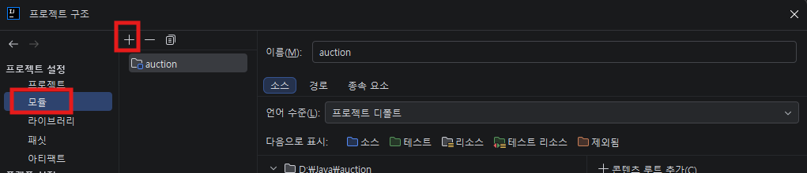
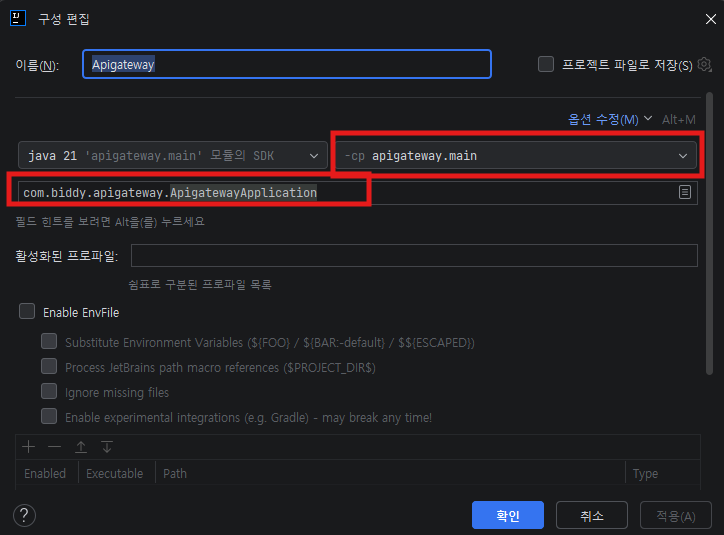
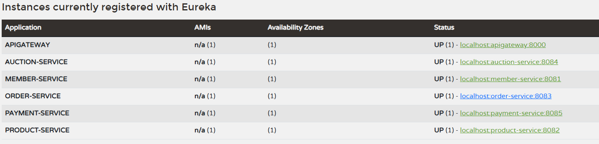

# Biddy MSA 실행 가이드

## 사전 요구사항

- Java 21 설치
- Docker & Docker Compose 설치 (Docker 실행 시)
- PostgreSQL 16 설치 (로컬 실행 시)
- Apache Kafka 설치 (로컬 실행 시)

---

## 방법 1: Docker Compose 실행 (권장)

어떤 컴퓨터든 Docker만 설치되어 있으면 동일하게 동작합니다.

### 1-0. 환경변수 설정

프로젝트 루트에 `.env` 파일이 필요합니다. 없으면 아래 내용으로 생성하세요:

```env
## PostgreSQL
POSTGRES_PORT=5432
POSTGRES_USER=biddy
POSTGRES_PASSWORD=biddy1234
POSTGRES_DB=biddy

## Database names (서비스별 분리)
MEMBER_DB=biddy_member
PRODUCT_DB=biddy_product
ORDER_DB=biddy_order
AUCTION_DB=biddy_auction
PAYMENT_DB=biddy_payment
```

### 1-1. 전체 빌드

**Mac / Linux (Bash)**
```bash
cd discovery && ./gradlew bootJar && cd ..
cd config && ./gradlew bootJar && cd ..
cd apigateway && ./gradlew bootJar && cd ..
cd member && ./gradlew bootJar && cd ..
cd product && ./gradlew bootJar && cd ..
cd order && ./gradlew bootJar && cd ..
cd auction && ./gradlew bootJar && cd ..
cd payment && ./gradlew bootJar && cd ..
```

**Windows (PowerShell)**
```powershell
cd discovery; ./gradlew bootJar; cd ..
cd config; ./gradlew bootJar; cd ..
cd apigateway; ./gradlew bootJar; cd ..
cd member; ./gradlew bootJar; cd ..
cd product; ./gradlew bootJar; cd ..
cd order; ./gradlew bootJar; cd ..
cd auction; ./gradlew bootJar; cd ..
cd payment; ./gradlew bootJar; cd ..
```

### 1-2. 전체 서비스 기동

```bash
docker-compose up --build
```

> [캡처] docker-compose up 실행 후 전체 서비스 기동 로그

### 1-3. 특정 서비스만 기동

```bash
# 인프라 + 원하는 도메인만 선택
docker-compose up discovery config apigateway member product
```

### 1-4. 백그라운드 실행

```bash
docker-compose up -d
```

### 1-5. 서비스 중지

```bash
# 전체 중지
docker-compose down

# 전체 중지 + DB 데이터 삭제
docker-compose down -v
```

### 1-6. 로그 확인

```bash
# 전체 로그
docker-compose logs -f

# 특정 서비스 로그
docker-compose logs -f member
```

---

## 방법 2: 로컬 직접 실행 (개발용)

### 2-0. 인프라 사전 준비

로컬 실행 시 PostgreSQL과 Kafka가 미리 실행되어 있어야 합니다.

```sql
-- PostgreSQL에서 서비스별 데이터베이스 생성
CREATE DATABASE biddy_member;
CREATE DATABASE biddy_product;
CREATE DATABASE biddy_order;
CREATE DATABASE biddy_auction;
CREATE DATABASE biddy_payment;
```

> 또는 인프라만 Docker로 실행할 수도 있습니다:
> ```bash
> docker-compose up postgres kafka
> ```

### 2-1. 기동 순서 (반드시 순서대로)

```
0단계: PostgreSQL (5432) + Kafka (9092)
1단계: Discovery (8761)
2단계: Config   (8888)
3단계: API Gateway (8000)
4단계: 도메인 서비스 (순서 무관)
```

### 2-2. 각 서비스 실행

각 서비스 디렉토리에서 별도 터미널을 열어 실행합니다.

**Mac / Linux (Bash)**
```bash
# Discovery 먼저
cd discovery && ./gradlew bootRun

# 이후 별도 터미널에서 각각
cd config && ./gradlew bootRun
cd apigateway && ./gradlew bootRun
cd member && ./gradlew bootRun
cd product && ./gradlew bootRun
cd order && ./gradlew bootRun
cd auction && ./gradlew bootRun
cd payment && ./gradlew bootRun
```

**Windows (PowerShell)**
```powershell
# Discovery 먼저
cd discovery; ./gradlew bootRun

# 이후 별도 터미널에서 각각
cd config; ./gradlew bootRun
cd apigateway; ./gradlew bootRun
cd member; ./gradlew bootRun
cd product; ./gradlew bootRun
cd order; ./gradlew bootRun
cd auction; ./gradlew bootRun
cd payment; ./gradlew bootRun
```

### 2-3. IntelliJ 모듈 등록 (최초 1회)

프로젝트를 Clone한 뒤 IntelliJ에서 각 서비스를 모듈로 인식시켜야 합니다.

1. `File → Project Structure` (단축키: `Ctrl + Alt + Shift + S`)
2. 왼쪽 메뉴에서 `모듈(Modules)` 선택
3. 상단 `+` 버튼 → `Import Module` 클릭
4. 등록할 서비스 폴더 선택 (예: `discovery`) → `build.gradle` 파일 선택
5. Gradle 프로젝트로 Import 확인
6. 나머지 서비스도 동일하게 반복

```
등록할 모듈 목록:
├── discovery
├── config
├── apigateway
├── member
├── product
├── order
├── auction
└── payment
```



> 모든 모듈 등록 후 `프로젝트 구조 → 모듈` 화면에 위 목록이 표시되면 정상입니다.

### 2-4. IntelliJ에서 실행

#### Services 탭 활용
1. `View → Tool Windows → Services` (단축키: `Alt + 8`)
2. `+` → `Run Configuration Type` → `Spring Boot` 선택
3. 모든 Spring Boot 앱이 목록에 표시됨
4. `Run All` 버튼으로 전체 실행

> [캡처] IntelliJ Services 탭에서 전체 서비스 실행 화면

#### Compound Run Configuration
1. `Run → Edit Configurations` → `+` → `복합(Compound)` 선택
2. 각 Application을 추가
3. 한 번의 클릭으로 전체 서비스 기동

> ### Compound Run Configuration 설정 화면
> 


---

## 동작 확인

### Eureka 대시보드
```
http://localhost:8761
```
등록된 서비스 목록이 표시되면 정상입니다.

> ### Eureka 대시보드 - 전체 서비스 UP 상태
> 

### API Gateway 헬스체크
```
http://localhost:8000/actuator/health
```

> [캡처] API Gateway 헬스체크 응답 ({"status":"UP"})

### Swagger UI (각 도메인 서비스)
```
Member:  http://localhost:8081/swagger-ui/index.html
Product: http://localhost:8082/swagger-ui/index.html
Order:   http://localhost:8083/swagger-ui/index.html
Auction: http://localhost:8084/swagger-ui/index.html
Payment: http://localhost:8085/swagger-ui/index.html
```

> [캡처] Swagger UI 화면 예시 (아무 서비스 1개)

---

## 트러블슈팅

| 증상 | 원인 | 해결 |
|---|---|---|
| Eureka에 서비스 안 보임 | 등록에 최대 30초 소요 | 잠시 대기 후 새로고침 |
| Config 연결 실패 경고 | Config Server 미기동 | Discovery → Config 순서로 먼저 기동 |
| DB 연결 오류 | PostgreSQL 미실행 | PostgreSQL 기동 또는 docker-compose 사용 |
| Kafka 연결 오류 | Kafka 미실행 | Kafka 기동 또는 `docker-compose up kafka` |
| `.env` 관련 오류 | `.env` 파일 누락 | 프로젝트 루트에 `.env` 파일 생성 (1-0 참고) |
| 포트 충돌 | 이미 사용 중인 포트 | 해당 포트 프로세스 종료 후 재시작 |
