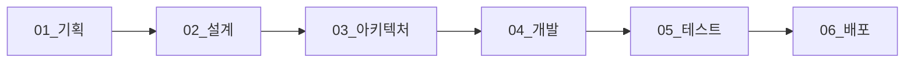
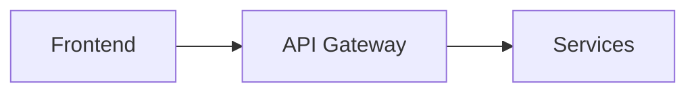

# Biddy 프로젝트 문서

온라인 경매 플랫폼 Biddy의 전체 프로젝트 문서입니다.

## 📂 문서 구조

```
docs/
├── 01_기획/              # 프로젝트 기획 문서
├── 02_설계/              # 상세 설계 문서
├── 03_아키텍처/          # 시스템 아키텍처
├── 04_개발/              # 개발 가이드
├── 05_테스트/            # 테스트 문서
├── 06_배포/              # 배포 및 운영 가이드
├── 07_회의록/            # 회의록 및 제안서
└── 08_산출물/            # 최종 산출물
```

---

## 📑 문서 목록

### 01. 기획

프로젝트 초기 기획 및 요구사항 정의 문서

- **[01_요구사항정의서](./01_기획/01_요구사항정의서.md)**
  - 기능 요구사항
  - 비기능 요구사항
  - 제약사항

- **[02_WBS](./01_기획/02_WBS.md)**
  - Work Breakdown Structure
  - 일정 계획

- **[03_화면설계서](./01_기획/03_화면설계서.md)**
  - UI/UX 설계
  - 화면 플로우

---

### 02. 설계

각 도메인별 상세 설계 문서

#### 도메인 서비스 설계

- **[01_회원서비스_상세설계](./02_설계/01_회원서비스_상세설계.md)**
  - 회원 가입/로그인
  - JWT 인증/인가
  - 비밀번호 관리

- **[02_상품서비스_상세설계](./02_설계/02_상품서비스_상세설계.md)**
  - 상품 CRUD
  - pgvector 임베딩
  - Elasticsearch 연동

- **[03_검색서비스_상세설계](./02_설계/03_검색서비스_상세설계.md)**
  - 키워드 검색
  - AI 추천
  - 자동완성

- **[07_경매서비스_상세설계](./02_설계/07_경매서비스_상세설계.md)**
  - 실시간 입찰
  - Transactional Outbox 패턴
  - WebSocket 연동

- **[04_채팅서비스_상세설계](./02_설계/04_채팅서비스_상세설계.md)**
  - WebSocket 실시간 채팅
  - STOMP 프로토콜
  - 읽음 처리

- **[05_주문서비스_상세설계](./02_설계/05_주문서비스_상세설계.md)**
  - 일반 주문 / 경매 낙찰 주문
  - 구매 확정
  - 자동 취소

- **[06_결제서비스_상세설계](./02_설계/06_결제서비스_상세설계.md)**
  - Toss Payments 연동
  - 결제 승인/취소/환불
  - 판매자 정산

- **[08_프론트엔드_구조](./02_설계/08_프론트엔드_구조.md)**
  - React 18 + Vite
  - WebSocket 연동
  - Vercel 배포

#### 기타 설계 문서

- **[14_도메인간_이벤트_흐름_정의](./02_설계/14_도메인간_이벤트_흐름_정의.md)**
  - Kafka 이벤트 정의
  - 서비스 간 통신

- **[15_구현_진행상황](./02_설계/15_구현_진행상황.md)**
  - 개발 현황
  - 완료/진행중 기능

---

### 03. 아키텍처

시스템 전체 아키텍처 및 기술 구조

- **[01_시스템_아키텍처](./03_아키텍처/01_시스템_아키텍처.md)**
  - 마이크로서비스 아키텍처
  - API Gateway 패턴
  - 보안 아키텍처
  - 배포 아키텍처
  - 모니터링 구성

- **[02_데이터베이스_설계](./03_아키텍처/02_데이터베이스_설계.md)**
  - ERD (모든 서비스)
  - 테이블 스키마
  - 인덱스 전략
  - 성능 최적화

**다이어그램**: 모든 문서는 Mermaid 다이어그램을 포함하여 시각적으로 이해하기 쉽습니다.

---

### 04. 개발

개발 환경 구성 및 코딩 규칙

- **[01_환경구성](./04_개발/01_환경구성.md)**
  - 로컬 개발 환경 설정
  - Docker Compose 구성
  - IDE 설정

- **[02_코딩컨벤션](./04_개발/02_코딩컨벤션.md)**
  - Java 코딩 스타일
  - Git 커밋 컨벤션
  - 네이밍 규칙

---

### 05. 테스트

테스트 계획 및 결과

- **[01_테스트계획서](./05_테스트/01_테스트계획서.md)**
  - 단위 테스트
  - 통합 테스트
  - 성능 테스트

- **[02_테스트결과서](./05_테스트/02_테스트결과서.md)**
  - 테스트 결과
  - 버그 리포트
  - 개선 사항

---

### 06. 배포

배포 및 운영 가이드

#### 배포 가이드

- **[01_실행가이드](./06_배포/01_실행가이드.md)**
  - 로컬 실행 방법
  - 환경 변수 설정

- **[02_Kubernetes_도입_가이드](./06_배포/02_Kubernetes_도입_가이드.md)**
  - K8s 아키텍처
  - 배포 전략

- **[03_AWS_EKS_배포_가이드](./06_배포/03_AWS_EKS_배포_가이드.md)**
  - EKS 클러스터 구성
  - CI/CD 파이프라인

- **[04_SSH_접속_문제해결_가이드](./06_배포/04_SSH_접속_문제해결_가이드.md)**
  - SSH 연결 트러블슈팅

- **[05_Docker_로컬_실행_가이드](./06_배포/05_Docker_로컬_실행_가이드.md)**
  - Docker Compose 사용법
  - 로컬 환경 구성

- **[06_NAS_배포_가이드](./06_배포/06_NAS_배포_가이드.md)**
  - NAS 서버 배포

#### 모니터링

- **[모니터링/01_모니터링_완전_가이드](./06_배포/모니터링/01_모니터링_완전_가이드.md)**
  - Prometheus + Grafana 설정
  - 메트릭 수집

- **[모니터링/02_Spring_Boot_Prometheus_설정_가이드](./06_배포/모니터링/02_Spring_Boot_Prometheus_설정_가이드.md)**
  - Spring Actuator 설정
  - Micrometer 연동

- **[모니터링/03_Grafana_빠른_시작](./06_배포/모니터링/03_Grafana_빠른_시작.md)**
  - Grafana 대시보드 생성

- **[모니터링/04_Grafana_완전_가이드](./06_배포/모니터링/04_Grafana_완전_가이드.md)**
  - 알람 설정
  - 대시보드 커스터마이징

- **[모니터링/05_모니터링_확인_가이드](./06_배포/모니터링/05_모니터링_확인_가이드.md)**
  - 메트릭 확인 방법

---

### 07. 회의록

회의록 및 기술 제안서

- **AI-DLC & AI 협업 개발 플레이북**
  - AI 활용 개발 가이드

- **Biddy_고도화_계획_및_기술_가이드**
  - 시스템 개선 방안

- **도메인별_엔터프라이즈_아키텍처_개선안**
  - 아키텍처 개선 제안

- **시스템_개선_및_추가기능_제안서**
  - 추가 기능 제안

- **[Auction 동시성 제어 설계 회의록](./07_회의록/Auction_동시성_제어_설계_회의록.md)**
  - 비관적 락 보완, 낙관적 락 충돌 처리, 조건부 UPDATE 및 경매별 큐 비교

---

### 08. 산출물

프로젝트 최종 산출물

- 발표 자료
- 데모 영상
- 최종 보고서

---

## 🎯 빠른 시작

### 1. 프로젝트 이해하기



**추천 순서:**
1. [01_기획/01_요구사항정의서](./01_기획/01_요구사항정의서.md) - 프로젝트 개요 파악
2. [03_아키텍처/01_시스템_아키텍처](./03_아키텍처/01_시스템_아키텍처.md) - 전체 구조 이해
3. [02_설계/README](./02_설계/README.md) - 도메인별 상세 설계
4. [06_배포/01_실행가이드](./06_배포/01_실행가이드.md) - 로컬 실행

### 2. 로컬 개발 환경 구성

```bash
# 1. 저장소 클론
git clone https://github.com/prgrms-be-adv-devcourse/beadv6_6_frontal_BE.git
cd beadv6_6_frontal_BE

# 2. Docker 컨테이너 실행
docker-compose up -d

# 3. 환경 변수 설정
cp .env.example .env

# 4. 서비스 실행 (Gradle)
./gradlew :auction:bootRun
```

**상세 가이드**: [06_배포/05_Docker_로컬_실행_가이드](./06_배포/05_Docker_로컬_실행_가이드.md)

### 3. API 문서 확인

- **Swagger UI**: http://localhost:8000/swagger-ui.html
- **각 서비스별 Swagger**:
  - Member: http://localhost:8081/swagger-ui.html
  - Product: http://localhost:8082/swagger-ui.html
  - Auction: http://localhost:8083/swagger-ui.html

---

## 🏗️ 기술 스택

### Backend
- **Framework**: Spring Boot 3.x
- **Language**: Java 17
- **API Gateway**: Spring Cloud Gateway
- **Database**: PostgreSQL 16 (with pgvector)
- **Cache**: Redis 7
- **Search**: Elasticsearch 8
- **Message Queue**: Apache Kafka

### Frontend
- **Framework**: React 18
- **Build Tool**: Vite
- **Deployment**: Vercel

### Infrastructure
- **Container**: Docker
- **Orchestration**: Kubernetes (EKS)
- **Cloud**: AWS
- **Monitoring**: Prometheus + Grafana

---

## 📊 프로젝트 현황

### 완료된 기능
- ✅ 회원 가입/로그인 (JWT)
- ✅ 상품 등록/조회
- ✅ 경매 생성/입찰
- ✅ 실시간 WebSocket
- ✅ Elasticsearch 검색
- ✅ AI 상품 추천
- ✅ Transactional Outbox 패턴

### 진행 중
- 🔄 채팅 서비스
- 🔄 주문/결제 통합
- 🔄 모니터링 대시보드

### 계획 중
- 📅 알림 서비스
- 📅 관리자 대시보드
- 📅 통계/분석 기능

**상세 현황**: [02_설계/15_구현_진행상황](./02_설계/15_구현_진행상황.md)

---

## 🤝 기여 가이드

### 브랜치 전략
```
main              # 프로덕션
  ├─ develop      # 개발 메인
  │   ├─ feature/xxx  # 기능 개발
  │   ├─ fix/xxx      # 버그 수정
  │   └─ docs/xxx     # 문서 작업
```

### 커밋 컨벤션
```
feat: 새로운 기능 추가
fix: 버그 수정
docs: 문서 수정
refactor: 코드 리팩토링
test: 테스트 코드
chore: 빌드 설정 등
```

**상세 규칙**: [04_개발/02_코딩컨벤션](./04_개발/02_코딩컨벤션.md)

---

## 📞 문의

- **GitHub Issues**: [프로젝트 이슈 페이지](https://github.com/prgrms-be-adv-devcourse/beadv6_6_frontal_BE/issues)
- **위키**: [프로젝트 위키](https://github.com/prgrms-be-adv-devcourse/beadv6_6_frontal_BE/wiki)

---

## 📚 참고 자료

### 공식 문서
- [Spring Boot](https://spring.io/projects/spring-boot)
- [Spring Cloud Gateway](https://spring.io/projects/spring-cloud-gateway)
- [PostgreSQL](https://www.postgresql.org/docs/)
- [Elasticsearch](https://www.elastic.co/guide/index.html)
- [Apache Kafka](https://kafka.apache.org/documentation/)

### 아키텍처 패턴
- [Microservices Patterns](https://microservices.io/patterns/index.html)
- [Transactional Outbox](https://microservices.io/patterns/data/transactional-outbox.html)

---

## 📝 문서 작성 가이드

### Mermaid 다이어그램 사용

모든 아키텍처 및 설계 문서는 Mermaid 다이어그램을 포함합니다.

**예시:**
````markdown

````

**도구**:
- IntelliJ Markdown Preview (자동 렌더링)
- [Mermaid Live Editor](https://mermaid.live/)

### 문서 템플릿

새 문서 작성 시 다음 구조를 따라주세요:

```markdown
# 문서 제목

## 개요
간단한 설명

## 도메인 모델 / ERD
Mermaid 다이어그램

## API 설계
시퀀스 다이어그램 + Request/Response

## 비즈니스 로직
코드 예시

## 데이터베이스
스키마 + 인덱스

## 참고 자료
```

---

**Last Updated**: 2024-07-15
